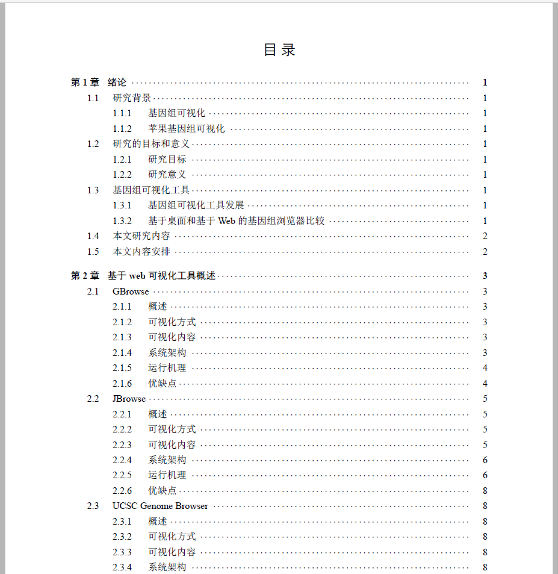

# NorthWestThesis
西北农林科技大学本科生毕业论文Latex模板

## 目录结构如下
- `figures` 资源文件存放目录
- `pagers` 论文章节目录
- `refs` 参考文献目录
- `utils` 引用其他宏目录
- `master.tex` 入库目录文件

## 使用方式
1. 使用编译软件打开`master.tex`
2. 使用`xelatex`编译器,进行编译
3. 编译后产生`master.pdf`

## 其他说明
1. `pagers`目录中存放着相应章节页面，只需在对应章节填写相应的内容
2. `pagers\message.aux`存放封面的相关信息，只需要进行按注释要求填写
3. `refs\thesis-ref.bib`存放参考文献数据，按格式写即可

## TODO
- [x]  优化文档结构
- [ ]  进一步将样式和内容分离
- [ ]  自定义样式库

## 论文排版要求

### 毕业论文
毕业论文整体规格A4，由封面、中英文摘要与关键词、目录、正文、致谢、参考文献和附录等部分组成。

### 论文题目
论文题目为二号黑体，可以分成1行或2行居中打印。

### 院系、专业年级、学生姓名、指导教师、合作指导教师、完成时间
宋体三号，居中。

### 摘要与关键词
- 论文题目：二号黑体字，可以分成1行或2行，居中
- 摘 要：二字为小四号黑体，前面空2个字，其后写摘要（字间空一格），后加冒号，摘要内容为五号宋体，摘要内容为1.5倍行距。
- 关键词：三字为小四号黑体，前面空2个字，其后写关键词（五号宋体），关键词间用分号“；”分隔，最后一个关键词后不加标点符号，关键词内容为单倍行距。
- 英文摘要：除字体为“Times New Roman”外，其他一切要求同中文摘要。

### 目录
- 目录字为三号黑体，居中；段前空1.5行，段后空1行。章标题用小四号黑体；节标题、小节标题用5号宋体。每一级标题与上一级标题相比，向右缩进一个字。
- 目录要另行编写页码，页码为罗马字符Ⅰ、Ⅱ、Ⅲ。
- 目录不加注页眉。

### 正文
- A4号纸型双面打印；
- 页面设置：上3厘米，下2厘米，左右边距各2.5厘米；页眉顶端距离2厘米，页脚顶端距离1厘米；
- 版面：行距20磅，字符间距为标准；
- 格式： 
	* 一级标题： （三号黑体，居中，段前、段后0.5行，样式为：第1章，数字为阿拉伯数字啊）
	* 二级标题： （四号黑体，居左，段前空两个字，段前、段后0.5行
	样式为：2.1，章序号为第一个数字，第二个数字表示节）
	* 三级标题： （小四号宋体加粗，居左，段前空两个字，段前、段后0.5行样式为：2.1.1）
	* 三级以下标题：（小四号宋体，居左，段前、段后0.5行样式为：（1）括号为中文状态下半角括号）
	* 论文正文：汉字为小四号宋体，英文为“Times New Roman”，段落缩进为首行缩进2字符，左右缩进均为0.5行。正文中如果涉及到代码，代码用5号Arial字体，行间距为17磅。

### 参考文献
参考文献单独成页，“参考文献”四字居中，为四号黑体，单独成行，段前段后0.5行。参考文献内容为五号宋体，行间距为17磅。

## 效果预览

